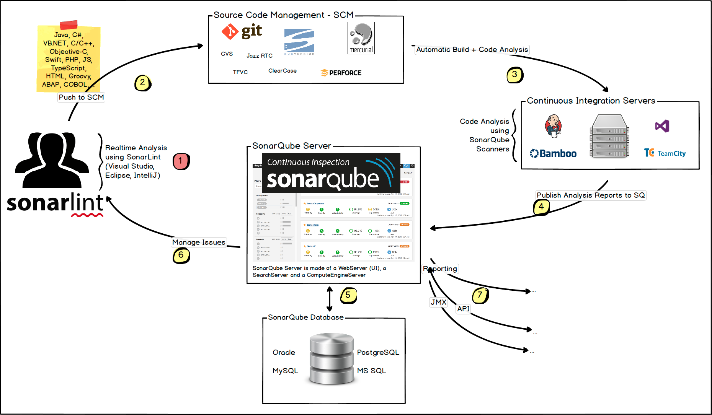
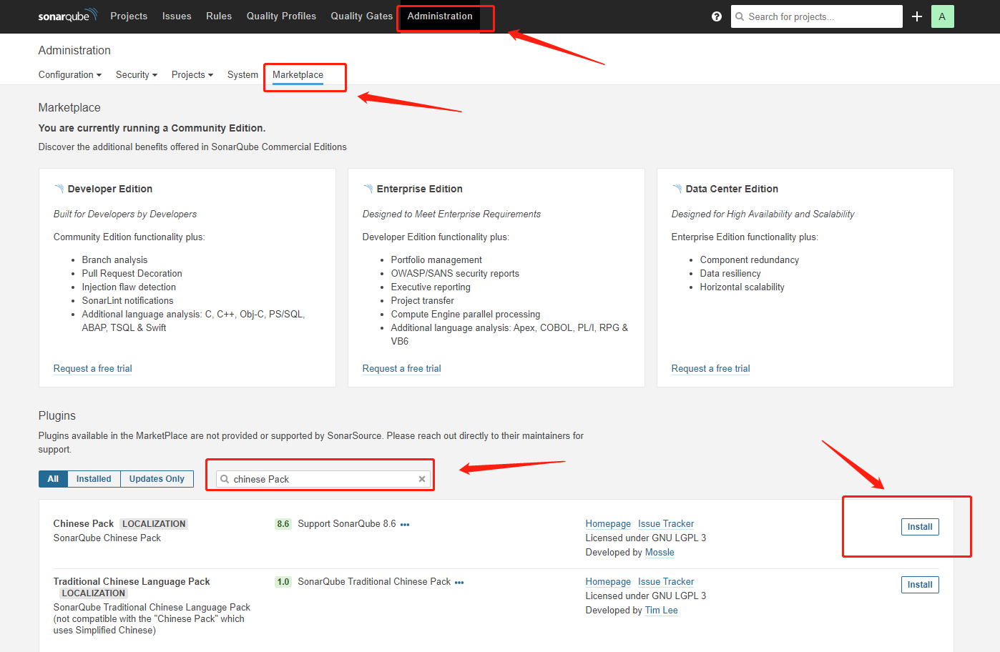

# Jenkins
- [Jenkins](#jenkins)
  - [1. Docker安装Jenkins容器](#1-docker安装jenkins容器)
    - [1. 拉取Jenkins镜像](#1-拉取jenkins镜像)
    - [2. 查看已拉取的镜像](#2-查看已拉取的镜像)
    - [3.运行jenkins镜像](#3运行jenkins镜像)
    - [4. 访问Jenkins](#4-访问jenkins)
    - [5. 个性化配置jenkins镜像Dockerfile：](#5-个性化配置jenkins镜像dockerfile)
  - [2. Pipeline](#2-pipeline)
  - [3. 集成代码扫描(SonarQube)](#3-集成代码扫描sonarqube)
    - [常见代码扫描工具/插件](#常见代码扫描工具插件)
    - [SonarQube](#sonarqube)
    - [maven集成sonarqube](#maven集成sonarqube)
  - [4. - 集成Allure插件生成单元测试报告](#4---集成allure插件生成单元测试报告)
  - [5. 集成docker](#5-集成docker)
  - [6. jenkins插件安装列表](#6-jenkins插件安装列表)
  ***官网指导文档：https://www.jenkins.io/zh/doc/pipeline/tour/getting-started/***
***

## 1. Docker安装Jenkins容器
### 1. 拉取Jenkins镜像
```
docker pull jenkins/jenkins:lts
```
### 2. 查看已拉取的镜像
```
docker images
```
### 3.运行jenkins镜像
```
docker run -d -v jenkins_home:/home/service/jenkins -p 7070:8080 -p 50000:50000 --name jenkins jenkins/jenkins:lts
```
参数说明

- -d 以守护模式运行镜像，也就是后台运行
- -v 把Jenkins容器内的目录挂载到宿主机的目录(主机目录：容器内目录)
- -p 端口映射，(主机端口):(容器内部端口)，7070是Jenkins访问端口，另外还要暴露一个tcp端口50000
- --name给容器起一个唯一的别名

### 4. 访问Jenkins
浏览器访问http://ip:7070即可进入Jenkins, 第一次进入需要登陆密码,需要进入jenkins容器里面获取.

- 进入jenkins容器
```
docker exec -it jenkins /bin/bash
```
- 查看密码
```
cat /var/jenkins_home/secrets/initialAdminPassword
```

### 5. 个性化配置jenkins镜像Dockerfile：

```
FROM jenkins/jenkins:lts

LABEL MAINTAINER Sean Lee<522046563@qq.com>

###拷贝maven安装包###
ADD apache-maven-3.8.2-bin.tar.gz /var/local
ADD settings.xml /var/local/apache-maven-3.8.2/conf/settings.xml

###定义环境变量###
ENV MVN_HOME /var/local/apache-maven-3.8.2
ENV PATH /var/local/apache-maven-3.8.2/bin:$PATH

WORKDIR /var/jenkins_home
```
***相关文件及脚本见：***
<a href="/docker_jenkins">/deocker_jenkins</a>


## 2. Pipeline

***官方语法符号文档：https://www.jenkins.io/doc/book/pipeline/syntax/***

Pipeline是Jenkins2.0以上版本提供的，利用Groovy语言提供构建，Gradle统一利用Groovy的语言特性作为构建工具，同时BlueOcean提供更简洁的页面以及其他特性。

Jenkins Pipeline 提供了一套可扩展的工具，用于将“简单到复杂”的交付流程实现为“持续交付即代码”。Jenkins Pipeline 的定义通常被写入到一个文本文件（称为 Jenkinsfile ）中，该文件可以被放入项目的源代码控制库中。

```
pipeline {
    agent any
    stages {
        stage('Build') {
            steps {
                sh 'echo "Hello World"'
                sh '''
                    echo "Multiline shell steps works too"
                    ls -lah
                '''
            }
        }
    }
}
```

- 超时、重试和更多
***Deploy”阶段（stage）重复执行 flakey-deploy.sh 脚本3次，然后等待 health-check.sh 脚本最长执行3分钟。 如果 health-check.sh 脚本在 3 分钟内没有完成，Pipeline 将会标记在“Deploy”阶段失败。***
```
pipeline {
    agent any
    stages {
        stage('Deploy') {
            steps {
                retry(3) {
                    sh './flakey-deploy.sh'
                }

                timeout(time: 3, unit: 'MINUTES') {
                    sh './health-check.sh'
                }
            }
        }
    }
}
```
***如果我们想要重试部署任务 5 次，但是总共花费的时间不能超过 3 分钟:***
```
pipeline {
    agent any
    stages {
        stage('Deploy') {
            steps {
                timeout(time: 3, unit: 'MINUTES') {
                    retry(5) {
                        sh './flakey-deploy.sh'
                    }
                }
            }
        }
    }
}
```
- 完成时动作
```
pipeline {
    agent any
    stages {
        stage('Test') {
            steps {
                sh 'echo "Fail!"; exit 1'
            }
        }
    }
    post {
        always {
            echo 'This will always run'
        }
        success {
            echo 'This will run only if successful'
        }
        failure {
            echo 'This will run only if failed'
        }
        unstable {
            echo 'This will run only if the run was marked as unstable'
        }
        changed {
            echo 'This will run only if the state of the Pipeline has changed'
            echo 'For example, if the Pipeline was previously failing but is now successful'
        }
    }
}
```

- 定义执行环境
  agent 指令告诉Jenkins在哪里以及如何执行Pipeline或者Pipeline子集。

在执行引擎中，agent 指令会引起以下操作的执行：   

***所有在块block中的步骤steps会被Jenkins保存在一个执行队列中。 一旦一个执行器 executor 是可以利用的，这些步骤将会开始执行。***

在Pipeline中可以很容易的运行 Docker 镜像和容器。 Pipeline可以定义命令或者应用运行需要的环境和工具， 不需要在执行代理中手动去配置各种各样的系统工具和依赖。 这种方式可以让你使用 Docker容器工具包 中的任何工具。

```
pipeline {
    agent {
        docker { image 'node:7-alpine' }
    }
    stages {
        stage('Test') {
            steps {
                sh 'node --version'
            }
        }
    }
}
```

-  使用环境变量
  ***环境变量可以像下面的示例设置为全局的，也可以是阶段（stage）级别的。***
  ```
    pipeline {
        agent any
  
        environment {
            DISABLE_AUTH = 'true'
            DB_ENGINE    = 'sqlite'
        }
  
        stages {
            stage('Build') {
                steps {
                    sh 'printenv'
                }
            }
        }
    }
  ```
  - 记录测试和构建结果
    只要您的测试运行时可以输出测试结果文件，Jenkins 就可以记录和汇总这些测试结果。 ***Jenkins 通常与 junit 步骤捆绑在一起，但如果您的测试运行结果无法输出 JUnit 样式的 XML 报告， 那么还有其他插件可以处理任何广泛使用的测试报告格式。***

```
pipeline {
    agent any
    stages {
        stage('Test') {
            steps {
                sh './gradlew check'
            }
        }
    }
    post {
        always {
            junit 'build/reports/**/*.xml'
        }
    }
}   
```

***这将会获得测试结果，Jenkins 会持续跟踪并计算测试的趋势和结果。 如果存在失败的测试用例，Pipeline 会被标记为 “UNSTABLE”，在网页上用黄色表示， 这不同于使用红色表示的 “FAILED” 失败状态。***

当出现测试失败时，通常可以从 Jenkins 中获取构建结果报告进行本地分析和测试。 Jenkins 内置支持存储构建结果报告，在 Pipeline 执行期间生成记录文件。

通过 archiveArtifacts 步骤和文件匹配表达式可以很容易的完成构建结果记录和存储， 如下例所示：

```
pipeline {
    agent any
        stages {
            stage('Build') {
                steps {
                    sh './gradlew build'
                }
            }
            stage('Test') {
                steps {
                    sh './gradlew check'
                }
            }
        }

        post {
            always {
                archiveArtifacts artifacts: 'build/libs/**/*.jar', fingerprint: true
                junit 'build/reports/**/*.xml'
        }
    }
}
```

 - 清理和通知
    因为 post 部分保证在 Pipeline 结束的时候运行， 所以我们可以添加通知或者其他的步骤去完成清理、通知或者其他的 Pipeline 结束任务。
```
pipeline {
    agent any
    stages {
        stage('No-op') {
            steps {
                sh 'ls'
            }
        }
    }
    post {
        always {
            echo 'One way or another, I have finished'
            deleteDir() /* clean up our workspace */
        }
        success {
            slackSend channel: '#ops-room',
                  color: 'good',
                  message: "The pipeline ${currentBuild.fullDisplayName} completed successfully."
        }
        unstable {
            echo 'I am unstable :/'
        }
        failure {
            mail to: 'team@example.com',
             subject: "Failed Pipeline: ${currentBuild.fullDisplayName}",
             body: "Something is wrong with ${env.BUILD_URL}"
        }
        changed {
            echo 'Things were different before...'
        }
    }
}
```
- 部署
大多数最基本的持续交付 Pipeline 至少会有三个阶段：构建、测试和部署，这些阶段被定义在 Jenkinsfile 中。

```
pipeline {
    agent any
    stages {
        stage('Build') {
            steps {
                echo 'Building'
            }
        }
        stage('Test') {
            steps {
                echo 'Testing'
            }
        }
        stage('Deploy - Staging') {
            steps {
                sh './deploy staging'
                sh './run-smoke-tests'
            }
        }
        stage('Deploy - Production') {
            steps {
                sh './deploy production'
            }
        }
    }
}
```

## 3. 集成代码扫描(SonarQube)

### 常见代码扫描工具/插件
  - ***checkstyle***
    Checkstyle 是 SourceForge 的开源项目，通过检查对代码编码格式，命名约定，Javadoc，类设计等方面进行代码规范和风格的检查，从而有效约束开发人员更好地遵循代码编写规范。
  - ***FindBugs***
    FindBugs 是由马里兰大学提供的一款开源 Java 静态代码分析工具。基于Bug Patterns概念，查找javabytecode（.class文件）中的潜在bug
  - ***pmd***
    PMD 是由 DARPA 在 SourceForge 上发布的开源 Java 代码静态分析工具。主要分析java源文件有没有潜在的bug，重复的代码，多度复杂的表达式等等。
  -  Jdepend
    主要用来分析代码的依赖及健壮性，它遍历Java class的文件目录，以Java包（package）为单位，为每一个包/类自动生成 包的依赖程度，稳定性，可靠度等的评价报告，根据这些报告，我们可以得到包或类之间的依赖关系，并分析出包的稳定程度，抽象程度，是否存在循环依赖关系等。
  -  simian
    现有的版本是基于maven1仓库的，而且有版权的问题，可以使用pmd来替代
  -  javancss
    代码的度量工具，检查java源文件、类、方法等更细粒度的指标，提供圈复杂度
  -  cobertura
    提供代码测试覆盖率
  -  emma
    也是代码测试覆盖率，但是版本较旧，可用cobertura来替代
  -  taglist
    用来检测代码里头的TODO
  -  duplicateFinder
    提供重复依赖检查

maven 插件配置：
```
<!-- 静态代码检查 -->
<plugin>
    <groupId>org.apache.maven.plugins</groupId>
    <artifactId>maven-checkstyle-plugin</artifactId>
    <version>2.11</version>
    <configuration>
        <configLocation>checkstyle.xml</configLocation>
        <includeResources>false</includeResources>
        <failOnViolation>true</failOnViolation>
        <violationSeverity>info</violationSeverity>
        <maxAllowedViolations>0</maxAllowedViolations>
        <consoleOutput>true</consoleOutput>
        <encoding>UTF-8</encoding>
        <includes>
            **\/package\/**.java,**\/otherpackage\/**.java
        </includes>
    </configuration>
<!--     <executions>
         <execution>
             <goals>
                 <goal>check</goal>
             </goals>
             <phase>validate</phase>
         </execution>
     </executions>-->
</plugin>

<plugin>
    <groupId>org.apache.maven.plugins</groupId>
    <artifactId>maven-pmd-plugin</artifactId>
    <version>2.7.1</version>
    <configuration>
        <failurePriority>5</failurePriority>
        <failOnViolation>true</failOnViolation>
        <targetJdk>${jdk.version}</targetJdk>
        <verbose>true</verbose>
        <outputEncoding>UTF-8</outputEncoding>
        <rulesets>
            <ruleset>pmd.xml</ruleset>
        </rulesets>
        <includes>
            <include>**\/package\/**.java</include>
            <include>**\/otherpackage\/**.java</include>
        </includes>
    </configuration>
  <!--   <executions>
         <execution>
             <phase>package</phase>
             <goals>
                 <goal>check</goal>
             </goals>
         </execution>
     </executions>-->
</plugin>
<plugin>
    <groupId>org.codehaus.mojo</groupId>
    <artifactId>findbugs-maven-plugin</artifactId>
    <version>2.5.2</version>
    <configuration>
        <onlyAnalyze>
            cn.shenyanchao.package.*,
            cn.shenyanchao.otherpackage.*,
        </onlyAnalyze>
        <includeFilterFile>findbugs.xml</includeFilterFile>
        <failOnError>true</failOnError>
        <outputEncoding>UTF-8</outputEncoding>
    </configuration>
 <!--   <executions>
        <execution>
            <phase>package</phase>
            <goals>
                <goal>check</goal>
            </goals>
        </execution>
    </executions>-->
</plugin>
```
maven插件使用命令：
```
mvn -B clean package findbugs:findbugs checkstyle:checkstyle pmd:pmd
```

### SonarQube
  Sonar是代码质量管理平台，它提供了插件扩展机制，可以支持PMD、FindBug、checkstyle等，对于Java项目默认执行CheckStyle, FindBugs以及PMD检测，同时也对检测结果进行存储，然后提供了可视化的面板，可以查看相关趋势。
- ***docker安装SonarQube***
  拉取镜像：
  
  ```
    docker pull sonarqube
  ```
  启动容器：
  ```
  //注意：直接运行docker镜像版本使用的是Embedded数据库，实际使用最好配置postgreSQl数据库
  docker run -d --name sonarqube -e SONAR_ES_BOOTSTRAP_CHECKS_DISABLE=true -p 9000:9000 sonarqube:latest
  ```
  
- ***登录SonarQube Server***
  http://localhost:9000
  默认用户名: admin
  默认密码： admin

- ***汉化***
  

- ***docker-compose安装sonar-community版***
```
version: "3"

services:
  sonarqube:
    image: sonarqube:8.3.1-community
    container_name: sonarqube
    restart: 'no'
    networks:
      - sonarnet
    environment:
      - sonar.jdbc.username=sonar
      - sonar.jdbc.password=sonar
      - sonar.jdbc.url=jdbc:postgresql://sonarqube-postgre:5432/sonarqube
      - sonar.search.javaOpts=-Xms256m -Xmx256m
    ports:
      - "9010:9000"
      - "9011:9092"
    depends_on:
      - sonarqube-postgre
    links:
      - sonarqube-postgre
    volumes:
      - sonarqube_data:/opt/sonarqube/data
      - sonarqube_extensions:/opt/sonarqube/extensions
      - sonarqube_bundled-plugins:/opt/sonarqube/lib/bundled-plugins

  sonarqube-postgre:
    image: postgres:12.3
    container_name: sonarqube-postgre
    restart: 'no'
    networks:
        - sonarnet
    environment:
      - POSTGRES_USER=sonar
      - POSTGRES_PASSWORD=sonar
      - POSTGRES_DB=sonarqube
    volumes:
      - sonarqube_postgre_db:/var/lib/postgresql
      - sonarqube_postgre_data:/var/lib/postgresql/data

volumes:
  sonarqube_bundled-plugins:
  sonarqube_data:
  sonarqube_extensions:
  sonarqube_postgre_db:
  sonarqube_postgre_data:

networks:
  sonarnet:
    driver: bridge
```
```groovy
# 启动错误
ERROR: [1] bootstrap checks failed. You must address the points described in the following [1] lines before starting Elasticsearch.
bootstrap check failure [1] of [1]: max virtual memory areas vm.max_map_count [65530] is too low, increase to at least [262144]
ERROR: Elasticsearch did not exit normally - check the logs at /opt/sonarqube/logs/sonarqube.log

# 解决方案
sysctl -w vm.max_map_count=262144
# 也可以在sysctl.conf加入vm.max_map_count=262144
vim /etc/sysctl.conf
# 文件最后添加一行
vm.max_map_count=262144
# 重啟
sysctl -p
# 然后再启动
docker-compose up -d
```


***注意事项：***

- sonarqube 的镜像数据挂载，最好使用数据卷volume。
- 在多个 sonarqube 实例 中不可使用相同的数据卷。
- 每个 sonarqube 实例 最好有自己的单独的 数据库schema。
es在linux环境下运行需要注意的必要环境，可以看 下方的参考链接，[sonarqube镜像]
- ***当宿主机的内存比较小的时候，在镜像文件中需要增加 sonar.search.javaOpts=-Xms256m -Xmx256m参数***，否则可能会出现 [SonarQube Process exited with exit value [es]: 137]问题。
https://stackoverflow.com/questions/47835125/sonarqube-process-exited-with-exit-value-es-137)

### maven集成sonarqube
在settings.xml中添加sonar服务器profile配置：
```
<profiles>
    <profile>
      <id>sonar</id>
      <properties>
        <sonar.host.url>http://localhost:9000</sonar.host.url>
        <sonar.login>admin</sonar.login>
        <sonar.password>Sean123456@</sonar.password>
        <sonar.inclusions>**/*.java,**/*.xml</sonar.inclusions>
      </properties>
    </profile>
</profiles>

<activeProfiles>
    <activeProfile>sonar</activeProfile>
</activeProfiles>
```
***之后就可以在maven命令中添加sonar代码扫描步骤：***
```
mvn clean -DskipTests package sonar:sonar
```
另外一种不用修改settings.xml配置的方式是：
- 首先在sonar服务器生成一个token
- 在maven命令中添加sonar扫描指令
  ```
  mvn clean -DskipTests package sonar:sonar \
  -Dsonar.projectKey=WorkoutService \
  -Dsonar.host.url=http://localhost:9010 \
  -Dsonar.login=c96d3b29b952aaa161cdbf4d27797389b7a1d202
  ```
  ***SonarQube服务器比较重量级宿主机内存配置要求较高***

## 4. - 集成Allure插件生成单元测试报告
***jenkins配置官方指导：https://docs.qameta.io/allure/#_jenkins***


## 5. 集成docker


## 6. jenkins插件安装列表

- ***推荐安装***
- ***Allure Jenkins Plugin*** -- This plugin integrates Allure reporting tool into Jenkins.
- ***Blue Ocean***
- ***Docker***
- ***Docker Pipeline***
- ***Pipeline***
- ***Git***


